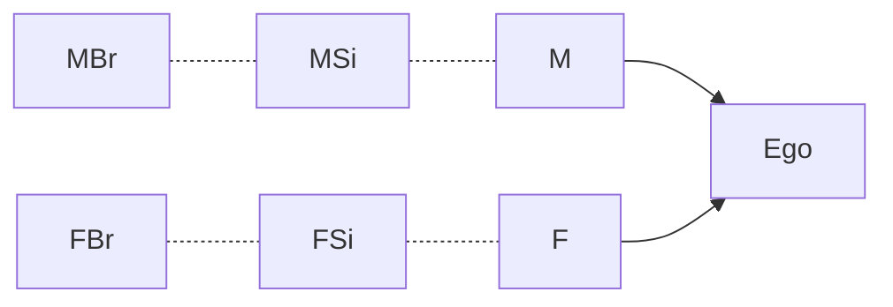

# What is Culture
## Provided Definitions
****
**Goldstein's Simplification:** Culture is a basic concept that refers to the shared beliefs, values, practices, norms, symbols, languages, behaviors, and material objects that characterize a particular group of people.

**James Spradley's Definition:** Culture is that acquired and shared knowledge that people use to Interpret experience and generate social behavior.
****
**Textbook Definition:** Customary ways a particular population of study thinks and behaves.
[[Culture Example]]: In the linked example, how might different cultures group the shapes
	America might, for example, organize by size, color, or shape
			*Color may be more accurate due to American Racism and its history*
		These Categories, however, are **arbitrary**, ==just like culture==
*the way different cultures categorize parts of life is arbitrary. This is important to remember*
>[!note]
>The terms 'society' and 'culture' are **not** synonymous. Society refers to a group of people; culture refers to the learned and shared behaviors, ideas, and characteristic of those people.

*Behaviors can also produce products or material culture, including houses, musical instruments, and tools that are the products of customary behavior.*
[[Cultural Constraints and Relativism|Constraints]]: Can be direct and indirect, which is explored further here.
****
**Definition of Enculturation:** Also known as socialization, the complex process of conscious and unconscious learning through which older generations induce younger generations to adopt the groups culture as their own.
****
## Ego's Family

For all intents and purposes, Ego is used to represent the middle of a family tree being examined. *This is also means the center of a given kinship diagram*
- In America, we are taught to call both our mom and dads brother's aunts and uncles respectively
Not all cultures treat this equally
- In Tibetan, for example, call FBr and FSi their ago and ani, respectively. Their MBr and MSi are called somo and ashag. 
- The titles are not interchangeable, and it is incorrect practice to address them equally according to Tibetan culture.
#### **In Summary**
	For something to be considered cultural, it must not only be shared but also learned
- Genealogy/biology - independent of culture
		American culture - equal treatment
		Tibetan Culture - treat aunt/uncle different on either side of the family
- Culture is the acquired and shared knowledge that people use to:
1. Interpret Experience
2. Generate Social Behavior
**==Culture is ARBITRARY==**
# Extending Culture: 
[[Culture as a Template]]: Describes The way culture is viewed and described
[[Culture and Society]] and [[Cultural Constraints and Relativism|Relativism]] Reflect the impacts and purposes of cultures

